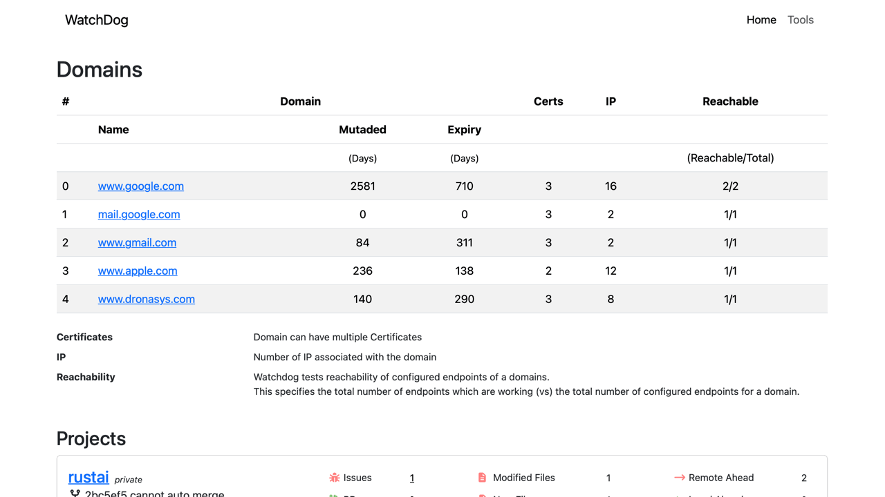

# watchdog



Watchdog is a dashboard, for showing domains and certificates for expiry, and endpoints connectivity. Watches a configured list of
projects in your local code base, and reads information from remote github server.

* Domains
  * Show connectivity status of configured list of domains
  * Shows certification validity 
  * Show reachability of multiple configured endpoints per domain
  * Show whois database for the domain
  * Show if whois data was modified recently in under 30 days
* Projects 
  * Show list of configured git projects from your local repo
  * Shows open issues against the project
  * Show open PR's against the project
  * Show number of modified and new files in the repo, on local machine
  * Compare against remote github, to show if master can be merged
  * Show if remote is ahead or behind local master

Work in progress.

## Install

Clone the project and run, docker is needed. Change the ./devcontainer/devcontainer.json to change the mount path.
This program needs to access all your git folders, that you want part of the dashboard.

```
make run
```

Via go
```
go install github.com/binuud/watchdog/cmd/watchdog@latest
```
OR

Download the watchdog binary from the release folder (https://github.com/binuud/watchdog/releases)

### Server Mode

Via go
```
go install github.com/binuud/watchdog/cmd/watchdogServer@latest
```
OR

Download the watchdogServer binary from the release folder (https://github.com/binuud/watchdog/releases)

## Usage

Note: whois data caching coming soon, if you run this in loop, whois data providers might block your ip.

create a config.yaml file with the following contents.

Sample Yaml file
Sub domains have to be treated as seperate entries
```
name: MyDomains
refreshinterval: 86400
domains:
    - uuid: ""
      name: www.google.com
      domainname: google.com
      endpoints:
        - https://www.google.com
        - https://www.google.com/?client=safari
    - uuid: ""
      name: www.gmail.com
      domainname: gmail.com
      endpoints:
        - https://www.gmail.com
    - uuid: ""
      name: www.dronasys.com
      domainname: dronasys.com
      endpoints:
        - https://www.dronasys.com
```

sample entry for subdomain
```
    - uuid: ""
      name: dev.example.com
      endpoints:
        - https://dev.example.com
        - https://dev.example.com/test1
```
Hope the yaml is self explanatory.

### Go Binary

* single run mode
```
watchdog --config-file [filename-with-path] --code_root_folder [absolute path of folder containing code]
```

* server mode
```
watchdogServer -v -grpc_port 10090 -http_port 10080 --config-file [filename-with-path] --code_root_folder [absolute path of folder containing code]
```


### Docker Image


```
docker pull dronasys/watchdog
```

To run once with the given config, use the following command, this will give the table output.
```
docker run -v ./config.yaml:/configs/config.yaml --entrypoint /watchDog  dronasys/watchdog  --file /configs/config.yaml   
```


To start the grpc and http server 
```
docker run --name WatchDog -p 10090:9090 -p 10080:9080 -d -v  "./config.yaml:/configs/config.yaml" dronasys/watchdog
```
* container port 9090 - grpc
* container port 9080 - http
* mount config file to /configs/config.yaml

When using docker image, the default entrypoint is the 'server'.


Once server is running, REST api can be used for getting details of domains, refer to swagger interface 
for details of the REST api's
```
curl -X GET 'http://localhost:9080/v1/watchdog/getAll?page=1&perPage=10' | jq
```

```
curl -X GET 'http://localhost:9080/v1/watchdog/getProjects?page=1&perPage=10' | jq
```

Get Details of a particular domain
```
curl -X GET 'http://localhost:9080/v1/watchdog/get?name=www.google.com' | jq
```

ReFetch all the information in the background (non blocking)
```
curl -X POST 'http://localhost:9080/v1/watchdog/reload' -d '{}'
```  

## Local Development

Checkout the UI project, is the parent folder of this project, so watchdog (this project) and watchdog-ui (ui project) are at the same level in the parent folder.

```
git clone https://github.com/binuud/watchdog-ui.git
```

When you are developing on this, or want to make changes, 
use below command to start a golang container, and mount the source code within the container
```
make start-container
```

from within the container, run the make command to select various targets
```
make
```

## Connectivity

* GRPC enabled, reflection enabled by default
* HTTP server enabled, [OpenApiSpec](/gen/web/v1/watchdog/openapi.json)
* Typescript interface at /gen/web/v1/watchdog/*.ts
* Docker image by default starts in server mode
* For looking at OpenApiSpec, clone the project, and run below command, from root of project.
```
docker run  -p 10030:8080 -v ./gen/web/v1/watchdog/openapi.json:/tmp/swagger.json -e SWAGGER_FILE=/tmp/swagger.json docker.swagger.io/swaggerapi/swagger-editor
```
*  After running above command, launch browser http://localhost:10030/

## TODO
* Complete tests
* If user base increases, and domain count increases optimize proto file
* MCP server coming soon
* In server mode, reload api/rpc has to be called by the client, once caching is enabled, watchdog will updates all domain details in fixed interval

## Credits

| For             | License     | Repo                                    | 
| :---            |    :----    |          :---                           |
| TabulationView  | MIT         | https://github.com/jedib0t/go-pretty    |
| WhoIsParser     | Apache 2.0  | https://github.com/likexian/whois       |
| Pkg Release     | NA          | https://goreleaser.com                  |
| UI Project      | MIT         | https://github.com/binuud/watchdog-ui   |

Usage videos will be uploaded here, this tool will be available as a AI Module on the BrainUI soon
* https://www.youtube.com/@dronasystems/shorts 
* https://www.youtube.com/@dronasystems/videos


## VSCode

* Dev Containers - for launching development containers

## .local.env

```
GITHUB_TOKEN=[GITHUB API TOKEN]
```